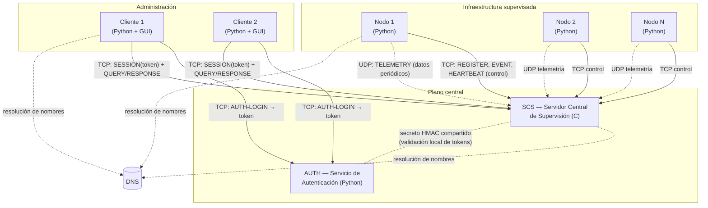
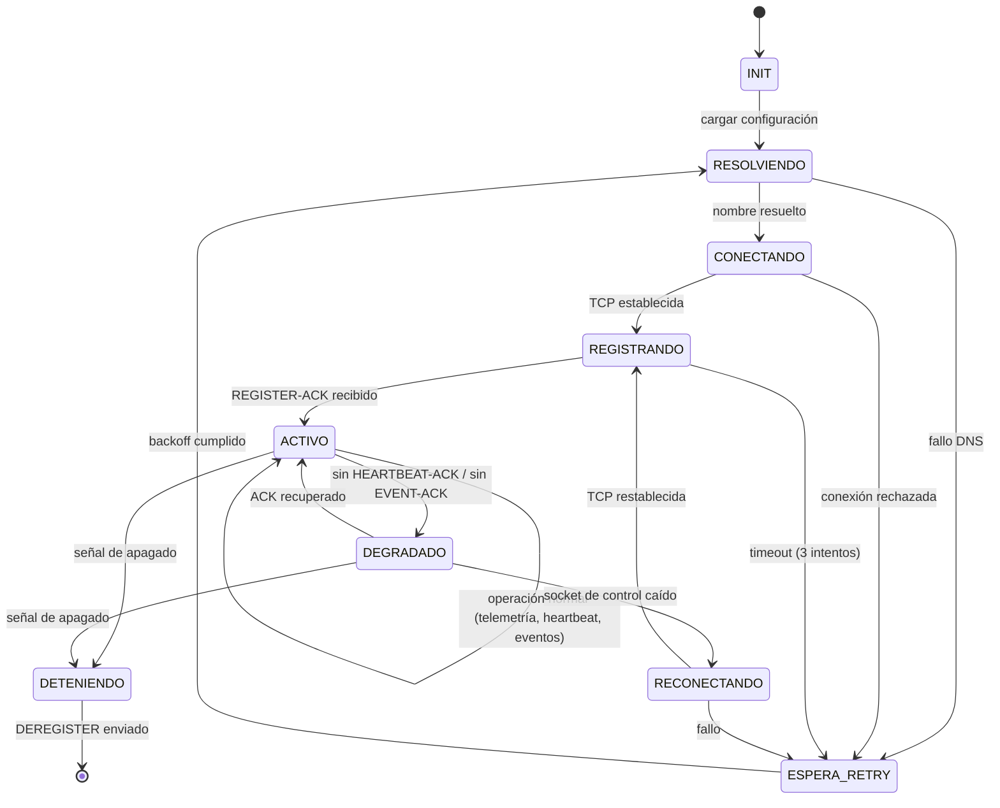
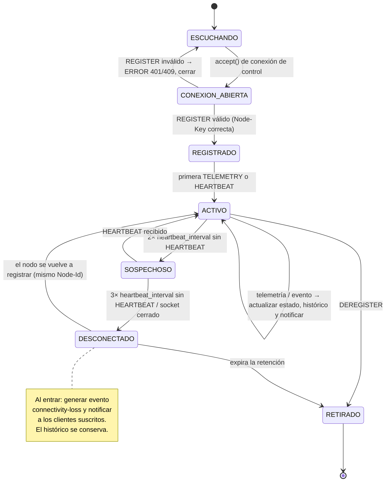
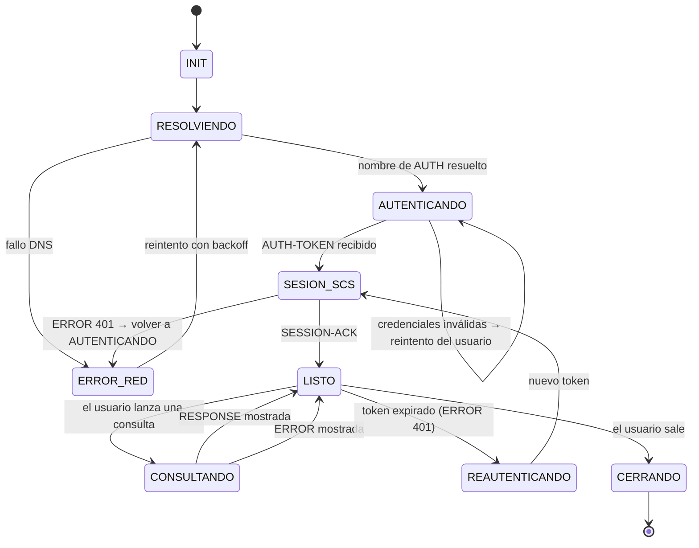
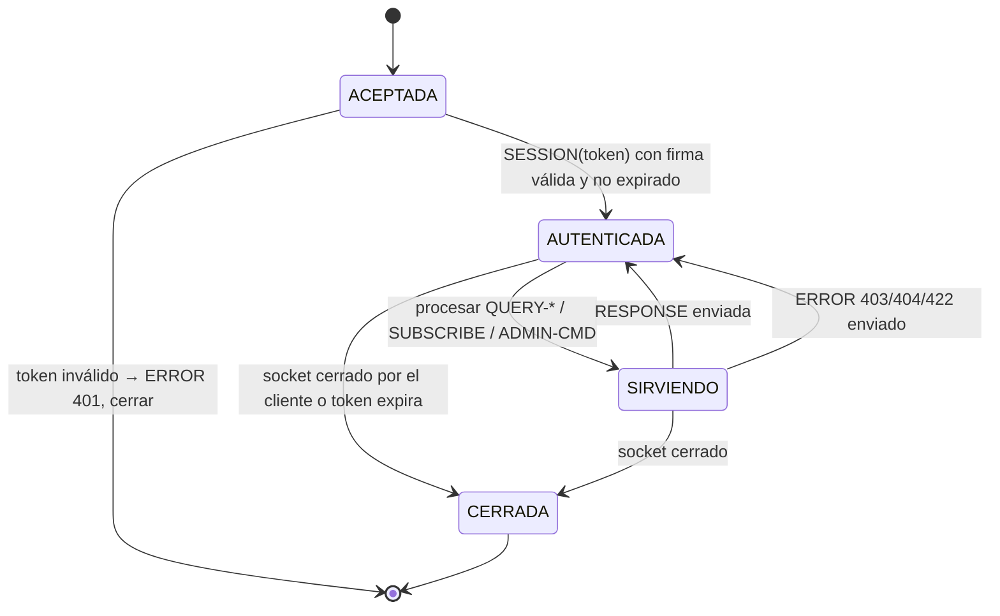

# Fase 1 — Diseño y Arquitectura

**Curso:** Internet: Arquitectura y Protocolos (Telemática) — 2026-2
**Proyecto:** Sistema de monitoreo distribuido y control
**Protocolo:** DMCP — *Distributed Monitoring and Control Protocol*, versión 1.0 (preliminar)
**Fecha de entrega:** 9 de septiembre de 2026

> Este documento corresponde a la Fase 1. La sintaxis y las máquinas de estado
> aquí presentadas son **preliminares** y se refinarán en las Fases 2 y 3, donde
> se consolidará la especificación completa con estructura tipo RFC.

---

## 1. Descripción general del problema

Una organización opera una infraestructura distribuida compuesta por múltiples
**nodos** (sensores, equipos de red, dispositivos IoT) que deben ser
supervisados de forma remota. Cada nodo debe:

- Informar **periódicamente** su estado mediante métricas de telemetría
  (utilización de CPU, temperatura, nivel de batería, estado operativo,
  disponibilidad, métricas de funcionamiento).
- Reportar la ocurrencia de **eventos críticos** (fallas, superación de
  umbrales, pérdida de conectividad, alarmas, cambios importantes de estado).

Un **Servidor Central de Supervisión (SCS)** recibe la información de todos los
nodos, mantiene un estado actualizado de la infraestructura y permite que
**clientes de administración** consulten dicha información. No existe
comunicación directa entre nodos y clientes: los nodos escriben hacia el SCS y
los clientes leen desde el SCS.

El sistema tiene dos clases de información con requisitos de comunicación
opuestos:

| Clase | Ejemplo | Pérdida de un mensaje | Frecuencia |
|---|---|---|---|
| Telemetría periódica | CPU 42 %, T 51 °C | Tolerable si el dato se actualiza pronto | Alta (cada pocos segundos) |
| Eventos críticos | "batería < 5 %", "enlace caído" | **No tolerable**, puede tener consecuencias graves | Baja y esporádica |

Esta diferencia es la que motiva un diseño de transporte **híbrido** (sección 6).

### 1.1 Objetivos de la solución

1. Integrar **varios protocolos reales de capa de aplicación** cooperando en un
   mismo sistema: un servicio de **resolución de nombres** (DNS), un servicio de
   **autenticación centralizada** (AUTH) y el servicio de **supervisión y
   petición de recursos** (SCS + DMCP).
2. Diseñar un protocolo de capa de aplicación (**DMCP**) cuya especificación sea
   suficientemente clara para que un tercero pueda implementarlo.
3. Justificar técnicamente el uso de TCP y/o UDP para cada tipo de mensaje.
4. Soportar **múltiples clientes concurrentes** y control de excepciones.

### 1.2 Alcance de la Fase 1

Se entrega: descripción del problema, arquitectura, entidades participantes,
catálogo de mensajes, sintaxis preliminar, reglas básicas de comunicación,
máquinas de estado y análisis preliminar TCP/UDP. **No** se implementa código
funcional en esta fase.

---

## 2. Arquitectura propuesta

### 2.1 Composición mínima del sistema

Según el requisito 1 del enunciado, la arquitectura mínima consta de:

- **Al menos 2 nodos** que reportan métricas (en las pruebas se ejecutarán
  ≥ 2 procesos nodo, en máquinas distintas o en la misma con puertos
  distintos).
- **Un** Servidor Central de Supervisión (SCS).
- **Un** Servicio de Autenticación (AUTH).
- **Uno o varios** clientes de administración.

No hay comunicación directa entre nodos y clientes: los nodos envían
información al SCS y los clientes la consultan desde el SCS.

### 2.2 Vista de componentes



### 2.3 Decisiones de arquitectura

| # | Decisión | Justificación |
|---|---|---|
| A1 | **Servidor central en C**, nodos y clientes en **Python** | Requisito del enunciado (servidor solo en C, API Berkeley). Python acelera el desarrollo de nodos y de la GUI del cliente. La interoperabilidad se garantiza usando un protocolo **de texto** (sección 4). |
| A2 | **Servicio AUTH separado** del SCS | El enunciado pide evitar un sistema de usuarios basado únicamente en archivos/BD locales *dentro de la aplicación principal*. AUTH es un componente independiente con su propio almacén de credenciales; el SCS nunca ve contraseñas. |
| A3 | **Tokens de sesión firmados con HMAC-SHA256** | El SCS valida el token **localmente** con un secreto compartido con AUTH: no hay una llamada de red por cada petición del cliente. TTL corto (15 min) + lista de revocación opcional. |
| A4 | **Transporte híbrido TCP + UDP** | Analizado en la sección 6. UDP para telemetría, TCP para todo lo que exige confiabilidad. |
| A5 | **Conexión TCP de control persistente** por nodo | Permite al SCS detectar la caída de un nodo (cierre de socket o expiración de *heartbeat*) y generar el evento "pérdida de conectividad". Sirve además de canal para comandos SCS → nodo (la parte "y control" del proyecto). |
| A6 | El SCS escucha **TCP y UDP en el mismo número de puerto** (`puerto` recibido por consola) | Simplifica la configuración: un solo parámetro de puerto. Son dos sockets distintos (`SOCK_STREAM` y `SOCK_DGRAM`). |
| A7 | **Sin direcciones IP embebidas**: toda dirección se obtiene por **nombre de dominio** vía `getaddrinfo` / `getaddrinfo`-equivalente | Requisito del enunciado. Si la resolución falla, se captura la excepción, se registra y se reintenta con *backoff*; el servicio no termina. |
| A8 | El SCS debe **atender varios nodos y clientes a la vez**. El enunciado permite el uso de **hilos** para ello. El modelo de concurrencia concreto se define e implementa en la Fase 3. | Requisito 3f y 10 del enunciado. En la Fase 1 basta con dejar constancia de que la arquitectura lo contempla. |
| A9 | **Estado en memoria** en el SCS: registro de nodos, histórico por nodo/métrica (*buffer* de las últimas N muestras) y lista de eventos. | El histórico requerido es pequeño (≥ 5 muestras por nodo). La persistencia a disco no es un requisito; sí lo es el log de peticiones/respuestas. |

### 2.4 Puertos y configuración

Ningún host se escribe como IP. Cada componente lee un archivo de configuración
(o parámetros de consola) con **nombres de dominio**:

| Componente | Parámetro | Ejemplo |
|---|---|---|
| SCS | `puerto`, `archivoDeLogs` (por consola) | `./scs 5000 /var/log/scs.log` |
| Nodo | `scs_host`, `scs_port`, `node_id`, `node_key` | `scs.telematica.local`, `5000` |
| Cliente | `auth_host`, `auth_port`, `scs_host`, `scs_port` | `auth.telematica.local`, `scs.telematica.local` |
| AUTH | `puerto`, ruta del almacén de usuarios, secreto HMAC | `6000` |

---

## 3. Entidades participantes

### 3.1 Nodo

- **Rol:** representa un elemento supervisado. Genera y envía telemetría y eventos.
- **Identidad:** `node_id` (cadena única) + `node_key` (secreto precompartido para registrarse).
- **Responsabilidades:**
  - Resolver el nombre del SCS y establecer la conexión de control TCP.
  - Registrarse (`REGISTER`) y recibir parámetros operativos (intervalo de telemetría, intervalo de *heartbeat*, puerto UDP del SCS).
  - Enviar `TELEMETRY` por UDP cada `telemetry_interval`.
  - Enviar `EVENT` por TCP ante una condición crítica, con confirmación obligatoria.
  - Enviar `HEARTBEAT` por TCP cada `heartbeat_interval`.
  - Atender `COMMAND` del SCS (p. ej. cambiar el intervalo, forzar una lectura).
  - Reconectarse ante caídas de la conexión de control.
- **Estado que mantiene:** su `session_id`, número de secuencia de telemetría, últimos parámetros operativos.

### 3.2 SCS — Servidor Central de Supervisión

- **Rol:** núcleo del sistema. Único componente en C.
- **Responsabilidades (requisito 3 del enunciado):**
  - a) Registrar los nodos que participan.
  - b) Recibir información periódica de estado (telemetría UDP).
  - c) Recibir eventos generados por los nodos (TCP, con ACK).
  - d) Mantener el estado de los nodos conectados (vivo/sospechoso/desconectado, últimas métricas, histórico).
  - e) Responder consultas sobre la infraestructura.
  - f) Atender **múltiples clientes de forma concurrente**.
- **Además:** *logging* en consola y archivo de toda petición/respuesta, incluyendo el identificador del cliente (IP y puerto de origen); recibe `puerto` y `archivoDeLogs` por consola.
- **Estado que mantiene:**
  - `registry[node_id] → { direccion_control, udp_endpoint, perfil_metricas, estado, ultimo_heartbeat, ultima_telemetria, ultimo_seq_udp }`
  - `history[node_id][metric] → buffer circular de N muestras (timestamp, valor)`
  - `events → lista de eventos recientes (node_id, tipo, severidad, timestamp, descripción, estado_ack)`
  - `sessions → sesiones de cliente activas (token válido, perfil, socket)`

### 3.3 Cliente de Administración

- **Rol:** consulta el estado de la infraestructura. No modifica nodos salvo perfil `admin`.
- **Responsabilidades:**
  - Autenticarse contra AUTH (`AUTH-LOGIN`) y obtener un token.
  - Abrir sesión con el SCS presentando el token (`SESSION`).
  - Consultar: lista de nodos con estado instantáneo, detalle de un nodo, **histórico (≥ 5 muestras)**, eventos.
  - Mostrar la información en una **interfaz de visualización sencilla**.
  - Perfil `admin`: enviar comandos a un nodo a través del SCS.
- **Estado que mantiene:** token y su expiración, `session_id` del SCS, perfil.

### 3.4 AUTH — Servicio de Autenticación

- **Rol:** autenticación centralizada y gestión de perfiles de usuario.
- **Responsabilidades:**
  - Mantener el almacén de usuarios (usuario, *hash* de contraseña con *salt*, perfil).
  - Validar credenciales (`AUTH-LOGIN`) y emitir un **token firmado** (`AUTH-TOKEN`).
  - Cerrar sesión (`AUTH-LOGOUT`) y, opcionalmente, publicar una lista de revocación.
- **Perfiles previstos:**

| Perfil | Permisos |
|---|---|
| `viewer` | Leer estado instantáneo de nodos |
| `operator` | `viewer` + leer histórico y eventos + suscribirse a actualizaciones |
| `admin` | `operator` + enviar comandos de control a los nodos |

### 3.5 DNS

Servicio de resolución de nombres (no se implementa; se usa el del sistema). Todo
componente resuelve los nombres de sus pares mediante `getaddrinfo`. El manejo de
fallo de resolución es un requisito explícito (sección 5.5).

---

## 4. Protocolo DMCP — formato de mensajes (sintaxis preliminar)

### 4.1 Justificación del formato

DMCP usa un **formato de texto orientado a líneas**, estilo RFC 822 / HTTP
(cabeceras `Clave: valor`, línea en blanco, cuerpo opcional). Motivos:

- **Interoperabilidad C ↔ Python:** el parsing en C se resuelve con
  `recv` + búsqueda de `\r\n\r\n` + `sscanf`/`strtok`, sin librerías externas.
- **Depurable:** cumple mejor el requisito de *logging* legible de
  peticiones y respuestas.
- **Extensible:** añadir una cabecera no rompe a un receptor antiguo.

En la Fase 2 se documentará también el tamaño de cada campo; los campos son
UTF-8 de longitud variable y el cuerpo se delimita con la cabecera `Length`.

### 4.2 Estructura general

```
DMCP/1.0 <TIPO> <TRANSPORTE>\r\n
Seq: <entero sin signo>\r\n
Session: <id de sesión | 0>\r\n
Ts: <timestamp epoch en ms>\r\n
[<Cabecera-Especifica>: <valor>\r\n]...
Length: <n>\r\n
\r\n
<cuerpo de n bytes>
```

- **Línea de inicio:** versión, `TIPO` de mensaje, `TRANSPORTE` esperado
  (`TCP` o `UDP`) — permite detectar un mensaje enviado por el canal equivocado.
- `Seq`: número de secuencia por conexión (TCP) o por sesión (UDP).
- `Session`: `0` mientras el emisor no tiene sesión establecida.
- `Ts`: marca de tiempo del emisor (para ordenar telemetría y fechar eventos).
- `Length`: longitud del cuerpo en bytes (0 si no hay cuerpo).

### 4.3 Flags de control (cabecera `Flags`)

| Flag | Significado |
|---|---|
| `ACK_REQ` | El emisor exige confirmación de este mensaje |
| `ACK` | Este mensaje **es** una confirmación (ver `Ack-Seq`) |
| `ERR` | Este mensaje transporta un error (cuerpo = descripción, ver tipo `ERROR`) |

### 4.4 Catálogo de mensajes

#### Plano de control nodo ↔ SCS (TCP)

| TIPO | Dirección | Cabeceras específicas | Cuerpo | ACK |
|---|---|---|---|---|
| `REGISTER` | Nodo → SCS | `Node-Id`, `Node-Key`, `Udp-Port` | Lista de métricas ofrecidas y capacidades | `REGISTER-ACK` |
| `REGISTER-ACK` | SCS → Nodo | `Session`, `Telemetry-Interval`, `Heartbeat-Interval`, `Udp-Endpoint` | — | — |
| `HEARTBEAT` | Nodo → SCS | — | — | `HEARTBEAT-ACK` |
| `HEARTBEAT-ACK` | SCS → Nodo | `Ack-Seq` | — | — |
| `EVENT` | Nodo → SCS | `Event-Id`, `Severity` (`info`/`warning`/`critical`), `Event-Type` | Descripción + instantánea de métricas | `EVENT-ACK` (`ACK_REQ` siempre) |
| `EVENT-ACK` | SCS → Nodo | `Ack-Seq`, `Event-Id` | — | — |
| `COMMAND` | SCS → Nodo | `Command-Id`, `Action` (`set-interval`/`read-now`/`reset`) | Parámetros | `COMMAND-RESULT` |
| `COMMAND-RESULT` | Nodo → SCS | `Ack-Seq`, `Command-Id`, `Status` | Detalle | — |
| `DEREGISTER` | Nodo → SCS | `Reason` | — | `REGISTER-ACK` (cierre ordenado) |

#### Plano de datos nodo → SCS (UDP)

| TIPO | Dirección | Cabeceras específicas | Cuerpo | ACK |
|---|---|---|---|---|
| `TELEMETRY` | Nodo → SCS | `Session`, `Seq` | Muestras `metrica=valor` separadas por `;` | No (salvo `ACK_REQ` explícito) |
| `TELEMETRY-ACK` | SCS → Nodo | `Ack-Seq` | — | Solo si el `TELEMETRY` pidió `ACK_REQ` |

#### Plano de cliente (TCP)

| TIPO | Dirección | Cabeceras / cuerpo | Respuesta |
|---|---|---|---|
| `AUTH-LOGIN` | Cliente → AUTH | cuerpo: `user`, `password` | `AUTH-TOKEN` o `ERROR` |
| `AUTH-TOKEN` | AUTH → Cliente | `Profile`, `Expires-At`; cuerpo: token | — |
| `AUTH-LOGOUT` | Cliente → AUTH | cuerpo: token | `OK` o `ERROR` |
| `SESSION` | Cliente → SCS | cuerpo: token | `SESSION-ACK` o `ERROR` |
| `SESSION-ACK` | SCS → Cliente | `Session`, `Profile` | — |
| `QUERY-NODES` | Cliente → SCS | `Filter` (opcional: `state=active`) | `RESPONSE` (lista de nodos + estado instantáneo) |
| `QUERY-NODE` | Cliente → SCS | `Node-Id` | `RESPONSE` (detalle + última telemetría) |
| `QUERY-HISTORY` | Cliente → SCS | `Node-Id`, `Metric`, `Count` (≥ 5) | `RESPONSE` (muestras históricas) |
| `QUERY-EVENTS` | Cliente → SCS | `Node-Id` (opcional), `Severity` (opcional), `Count` | `RESPONSE` (lista de eventos) |
| `SUBSCRIBE` | Cliente → SCS | `Node-Id` / `all` | `RESPONSE` + `UPDATE` asíncronos |
| `UPDATE` | SCS → Cliente | `Node-Id` | Cambio de estado / nueva telemetría / nuevo evento |
| `ADMIN-CMD` | Cliente (`admin`) → SCS | `Node-Id`, `Action`, parámetros | `RESPONSE`; el SCS reenvía como `COMMAND` al nodo |
| `RESPONSE` | SCS → Cliente | `Ack-Seq`, `Status` | cuerpo con el resultado |
| `ERROR` | cualquiera | `Ack-Seq`, `Code` | cuerpo: descripción legible |

### 4.5 Códigos de error (`ERROR` / cabecera `Code`)

| Código | Significado |
|---|---|
| `400 BAD_FORMAT` | Mensaje mal formado o cabecera obligatoria ausente |
| `401 UNAUTHENTICATED` | Falta token o token inválido/expirado |
| `403 FORBIDDEN` | El perfil no permite la operación |
| `404 UNKNOWN_NODE` | El `Node-Id` no existe |
| `409 ALREADY_REGISTERED` | El nodo ya tiene una sesión activa |
| `422 INVALID_PARAM` | Parámetro fuera de rango |
| `429 RATE_LIMITED` | Exceso de mensajes |
| `500 INTERNAL` | Error interno del servidor |
| `503 UNAVAILABLE` | Dependencia no disponible (p. ej. AUTH) |

### 4.6 Ejemplos

**Registro de un nodo (TCP):**

```
DMCP/1.0 REGISTER TCP
Seq: 1
Session: 0
Ts: 1757203200000
Node-Id: sensor-bodega-01
Node-Key: 9f2c1a7b4e
Udp-Port: 41000
Length: 46

metrics=cpu,temp,battery,status,availability
```

**Respuesta del SCS:**

```
DMCP/1.0 REGISTER-ACK TCP
Seq: 1
Session: 7731
Ts: 1757203200110
Ack-Seq: 1
Telemetry-Interval: 5
Heartbeat-Interval: 10
Udp-Endpoint: scs.telematica.local:5000
Length: 0

```

**Telemetría (UDP, sin ACK):**

```
DMCP/1.0 TELEMETRY UDP
Seq: 148
Session: 7731
Ts: 1757203945000
Length: 47

cpu=0.42;temp=51.3;battery=0.87;status=ok
```

**Evento crítico (TCP, con ACK obligatorio):**

```
DMCP/1.0 EVENT TCP
Seq: 12
Session: 7731
Ts: 1757203950000
Flags: ACK_REQ
Event-Id: sensor-bodega-01-000009
Severity: critical
Event-Type: threshold-exceeded
Length: 39

temp=88.1; umbral=80.0; accion=alarma
```

**Consulta de histórico (cliente → SCS):**

```
DMCP/1.0 QUERY-HISTORY TCP
Seq: 3
Session: 5510
Ts: 1757204000000
Node-Id: sensor-bodega-01
Metric: temp
Count: 5
Length: 0

```

---

## 5. Reglas básicas de comunicación

### 5.1 Establecimiento

1. Todo componente **resuelve por nombre** la dirección de su par (`getaddrinfo`).
2. **Nodo:** abre conexión TCP de control con el SCS → `REGISTER` → espera
   `REGISTER-ACK` con `Session` y parámetros → inicia telemetría UDP y *heartbeats*.
3. **Cliente:** conexión TCP con AUTH → `AUTH-LOGIN` → `AUTH-TOKEN` → cierra con
   AUTH → conexión TCP con el SCS → `SESSION(token)` → `SESSION-ACK` → consultas.

### 5.2 Numeración y correlación

- Cada emisor numera sus mensajes con `Seq` **creciente** (por conexión TCP; por
  sesión en UDP).
- Toda respuesta o confirmación incluye `Ack-Seq` con el `Seq` del mensaje al que
  responde. Así el emisor correlaciona pregunta y respuesta aunque lleguen
  intercaladas.

### 5.3 Confirmaciones

- `REGISTER`, `EVENT`, `COMMAND`, `ADMIN-CMD` y las consultas **siempre** se
  confirman (con `*-ACK` o `RESPONSE`).
- `TELEMETRY` **no** se confirma por defecto (ver sección 6).
- `HEARTBEAT` se confirma con `HEARTBEAT-ACK`; sirve para medir latencia y
  detectar un enlace degradado.

### 5.4 Temporizadores y reintentos

| Situación | Temporizador | Acción al expirar |
|---|---|---|
| Nodo espera `REGISTER-ACK` | 3 s | Reintentar hasta 3 veces; luego *backoff* exponencial (5 s, 10 s, 20 s, …, máx 60 s) |
| Nodo espera `EVENT-ACK` | 2 s | Retransmitir el mismo `Event-Id` hasta 3 veces; si falla, encolar en disco y reintentar tras reconexión |
| Nodo espera `HEARTBEAT-ACK` | 2 × `heartbeat_interval` | Marcar la conexión como sospechosa; forzar reconexión |
| SCS no recibe `HEARTBEAT` de un nodo | 3 × `heartbeat_interval` | Estado del nodo → `DESCONECTADO`; generar evento `connectivity-loss`; notificar a los clientes suscritos |
| Cliente espera `RESPONSE` | 5 s | Reintentar 1 vez; luego informar error al usuario |

### 5.5 Manejo de excepciones (requisito 11)

| Situación | Comportamiento definido |
|---|---|
| Fallo de resolución DNS | Capturar la excepción, registrarla en el log, reintentar con *backoff*. **El proceso no termina.** |
| Conexión TCP rechazada o caída | Reintentar con *backoff*; el nodo conserva su `node_id` y vuelve a registrarse; el SCS conserva el histórico del nodo. |
| Mensaje mal formado | Responder `ERROR 400 BAD_FORMAT` (si hay canal), registrar, **descartar** el mensaje y **mantener** la conexión. |
| Cabecera obligatoria ausente / valor fuera de rango | `ERROR 400` o `ERROR 422`, descartar el mensaje. |
| Token inválido o expirado | `ERROR 401`; el cliente debe repetir `AUTH-LOGIN`. |
| Operación no permitida por el perfil | `ERROR 403`, registrar el intento. |
| `Node-Id` desconocido en una consulta | `ERROR 404 UNKNOWN_NODE`. |
| Datagrama UDP de sesión desconocida | Descartar silenciosamente (posible sesión caída); registrar a nivel *debug*. |
| Telemetría con `Seq` menor o igual al último visto | Descartar (mensaje duplicado o fuera de orden); actualizar contador de pérdidas/duplicados. |

### 5.6 Cierre

- **Nodo:** `DEREGISTER(Reason)` → el SCS confirma y marca el nodo como
  `RETIRADO` (conserva su histórico como dato histórico).
- **Cliente:** cierra el socket; el SCS libera la sesión. Token sigue válido
  hasta su expiración salvo `AUTH-LOGOUT`.
- **Caída abrupta:** detectada por cierre de socket TCP o expiración de
  temporizador (sección 5.4).

### 5.7 Registro (*logging*, requisito de implementación)

Cada petición y cada respuesta que procesa el SCS se escribe **en consola y en
`archivoDeLogs`**, con: timestamp, identificador del cliente/nodo (`IP:puerto`
de origen), `TIPO`, `Seq`, `Session`, resultado (`Status`/`Code`).

Formato de línea de log (preliminar):

```
2026-09-09T14:32:05.114Z  RX  192.168.1.20:41522  QUERY-HISTORY  seq=3 session=5510  node=sensor-bodega-01 metric=temp count=5
2026-09-09T14:32:05.119Z  TX  192.168.1.20:41522  RESPONSE       seq=3 ack=3 status=200  rows=5
```

---

## 6. Análisis preliminar sobre el uso de TCP y UDP

El objetivo no es decidir cuál protocolo es "mejor", sino asignar a cada tipo de
mensaje el transporte cuyas garantías coinciden con las necesidades del mensaje.

### 6.1 Criterios de análisis

Para cada tipo de mensaje se consideran: tolerancia a pérdidas, frecuencia de
transmisión, tamaño, criticidad de la información, necesidad de orden, necesidad
de confiabilidad, necesidad de mantener una conexión, comportamiento ante
retardos y ante pérdidas.

### 6.2 Tabla de decisión por tipo de mensaje

| Mensaje | Tolera pérdida | Frecuencia | Tamaño | Criticidad | Requiere orden | Requiere confiabilidad | Requiere conexión | **Transporte** |
|---|---|---|---|---|---|---|---|---|
| `TELEMETRY` | **Sí** (el próximo dato lo reemplaza) | Alta (cada 5 s) | Pequeño (1 datagrama) | Baja | No (se usa `Ts`) | No | No | **UDP** |
| `REGISTER` / `REGISTER-ACK` | No | Una vez por sesión | Pequeño | Alta (sin registro no hay nodo) | Sí | Sí | Sí | **TCP** |
| `EVENT` / `EVENT-ACK` | **No** (puede tener consecuencias graves) | Baja, esporádica | Pequeño-medio | **Alta** | Sí | Sí | Sí | **TCP** |
| `HEARTBEAT` | Sí (individual), pero varios seguidos ⇒ nodo caído | Media (cada 10 s) | Mínimo | Media (señal de vida) | No | No | Sí (reutiliza la conexión de control) | **TCP** (sobre la conexión existente) |
| `COMMAND` / `COMMAND-RESULT` | No | Rara | Pequeño | Alta (control del nodo) | Sí | Sí | Sí | **TCP** |
| `AUTH-LOGIN` / `AUTH-TOKEN` | No | Rara | Pequeño | Alta (credenciales) | Sí | Sí | Sí | **TCP** |
| `SESSION` / consultas `QUERY-*` / `RESPONSE` | No | Media (interacción del usuario) | Medio-grande (histórico, listas) | Media-alta | Sí | Sí | Sí | **TCP** |
| `UPDATE` (suscripción) | Sí (el estado se puede volver a consultar) | Variable | Pequeño | Media | No | No estricta | Sí (canal cliente) | **TCP** (sobre el canal de sesión ya abierto) |

### 6.3 Racional

**Por qué UDP para `TELEMETRY`:**

- El enunciado dice explícitamente que "la pérdida ocasional de alguno de estos
  mensajes puede ser tolerable, siempre que la información sea actualizada
  periódicamente". El valor de una muestra caduca cuando llega la siguiente.
- Alta frecuencia × muchos nodos ⇒ mantener una conexión TCP con *estado* y
  control de congestión por cada flujo de telemetría es un costo innecesario.
- No se requiere orden estricto: el SCS usa la marca `Ts` y el `Seq` para quedarse
  con la muestra más reciente y descartar duplicados/rezagados.
- Ante retardo: una muestra que llega tarde ya no es útil; con TCP el
  *head-of-line blocking* retrasaría además las muestras siguientes. Con UDP cada
  datagrama es independiente.

**Por qué TCP para `EVENT`:**

- "En estos casos, la pérdida de un mensaje puede tener consecuencias importantes."
  ⇒ se necesita **entrega confiable y ordenada**.
- Son mensajes **poco frecuentes**: el costo de TCP es despreciable.
- Reutilizan la **conexión de control ya abierta** del nodo, así que no hay
  *handshake* adicional por evento.
- Permiten confirmación extremo a extremo (`EVENT-ACK`) y, si falla, el nodo
  puede encolar el evento y reintentar tras reconectar.

**Por qué una conexión TCP de control persistente por nodo:**

- Da al SCS una señal directa de disponibilidad: si el socket se cierra, el nodo
  cayó, y se genera el evento "pérdida de conectividad" sin esperar temporizadores
  largos.
- Sirve de canal bidireccional para `COMMAND` (SCS → nodo).
- Sobre esa misma conexión viajan `REGISTER`, `EVENT` y `HEARTBEAT`: un solo
  socket de control por nodo.

**Mecanismos de confiabilidad sobre UDP (definidos, uso reservado):**

DMCP define un mecanismo genérico para cuando un mensaje UDP necesite
confiabilidad: el emisor marca `Flags: ACK_REQ`, arranca un temporizador
(500 ms, *backoff* exponencial, máx. 3 intentos) y retransmite con el **mismo
`Seq`**; el receptor responde `*-ACK` con `Ack-Seq` y **deduplica por `Seq`**
dentro de una ventana. En el diseño actual **ningún** mensaje UDP usa este
mecanismo (la telemetría no lo necesita); queda especificado por si en la Fase 3
se decide mover algún mensaje a UDP con garantías. No se reimplementa TCP.

### 6.4 Resumen

- **UDP:** `TELEMETRY` (único).
- **TCP:** todo lo demás — registro, *heartbeats*, eventos, comandos,
  autenticación, sesiones de cliente y consultas.
- La arquitectura final es una **combinación de TCP y UDP**, justificada mensaje
  a mensaje según la sección 6.2.

---

## 7. Máquinas de estado

### 7.1 Nodo



### 7.2 SCS — sesión de un nodo



### 7.3 Cliente de Administración



### 7.4 SCS — sesión de un cliente



---

## 8. Alcance y trabajo restante

Este documento cubre los **ocho puntos requeridos por la Fase 1**. Queda
explícitamente **fuera del alcance de esta fase**:

- **Fase 2 (23 de septiembre):** implementación de los sockets Berkeley
  (crear / enlazar / escuchar / aceptar), el intercambio básico
  `REGISTER` / `TELEMETRY` / `EVENT` / `QUERY-*` y el parser de DMCP en C y
  en Python. Se consolidarán los tamaños de campo de la especificación.
- **Fase 3 (30 de septiembre):** concurrencia del SCS para atender varios
  nodos y clientes a la vez (se permite el uso de hilos), todos los
  temporizadores y reintentos de la sección 5.4, detección de nodos
  caídos, deduplicación de telemetría UDP, manejo exhaustivo de mensajes
  mal formados y parámetros inválidos, y batería de pruebas.

---

## Anexo A — Glosario

| Término | Definición |
|---|---|
| **DMCP** | Protocolo de capa de aplicación diseñado para este proyecto |
| **SCS** | Servidor Central de Supervisión (componente en C) |
| **AUTH** | Servicio de autenticación centralizada |
| **Nodo** | Elemento supervisado que emite telemetría y eventos |
| **Telemetría** | Métricas de estado enviadas periódicamente (CPU, temperatura, batería, …) |
| **Evento** | Notificación de una condición crítica y esporádica |
| **Heartbeat** | Mensaje periódico mínimo que indica que el nodo sigue vivo |
| **Token** | Credencial de sesión firmada con HMAC-SHA256 emitida por AUTH |
| **Sesión** | Contexto identificado por `Session` entre un par y el SCS |
