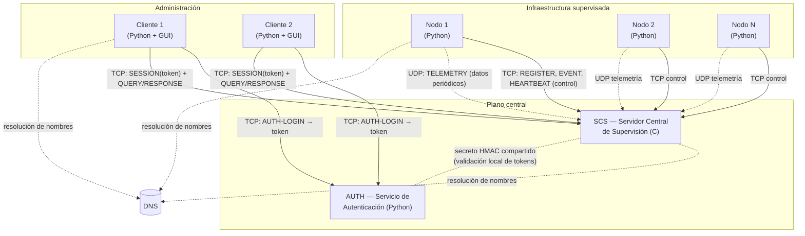

# 2. Arquitectura propuesta

## 2.1 Composición mínima del sistema

Según el requisito 1 del enunciado, la arquitectura mínima consta de:

- **Al menos 2 nodos** que reportan métricas (en las pruebas se ejecutarán
  ≥ 2 procesos nodo, en máquinas distintas o en la misma con puertos
  distintos).
- **Un** Servidor Central de Supervisión (SCS).
- **Un** Servicio de Autenticación (AUTH).
- **Uno o varios** clientes de administración.

No hay comunicación directa entre nodos y clientes: los nodos envían
información al SCS y los clientes la consultan desde el SCS.

## 2.2 Vista de componentes

## 2.3 Decisiones de arquitectura

| # | Decisión | Justificación |
|---|---|---|
| A1 | **Servidor central en C**, nodos y clientes en **Python** | Requisito del enunciado (servidor solo en C, API Berkeley). Python acelera el desarrollo de nodos y de la GUI del cliente. La interoperabilidad se garantiza usando un protocolo **de texto** (ver [Protocolo DMCP](4-Protocolo-DMCP)). |
| A2 | **Servicio AUTH separado** del SCS | El enunciado pide evitar un sistema de usuarios basado únicamente en archivos/BD locales *dentro de la aplicación principal*. AUTH es un componente independiente con su propio almacén de credenciales; el SCS nunca ve contraseñas. |
| A3 | **Tokens de sesión firmados con HMAC-SHA256** | El SCS valida el token **localmente** con un secreto compartido con AUTH: no hay una llamada de red por cada petición del cliente. TTL corto (15 min) + lista de revocación opcional. |
| A4 | **Transporte híbrido TCP + UDP** | Analizado en [Análisis TCP vs UDP](6-Analisis-TCP-UDP). UDP para telemetría, TCP para todo lo que exige confiabilidad. |
| A5 | **Conexión TCP de control persistente** por nodo | Permite al SCS detectar la caída de un nodo (cierre de socket o expiración de *heartbeat*) y generar el evento "pérdida de conectividad". Sirve además de canal para comandos SCS → nodo (la parte "y control" del proyecto). |
| A6 | El SCS escucha **TCP y UDP en el mismo número de puerto** (`puerto` recibido por consola) | Simplifica la configuración: un solo parámetro de puerto. Son dos sockets distintos (`SOCK_STREAM` y `SOCK_DGRAM`). |
| A7 | **Sin direcciones IP embebidas**: toda dirección se obtiene por **nombre de dominio** vía `getaddrinfo` | Requisito del enunciado. Si la resolución falla, se captura la excepción, se registra y se reintenta con *backoff*; el servicio no termina. |
| A8 | El SCS debe **atender varios nodos y clientes a la vez**. El enunciado permite el uso de **hilos** para ello. El modelo de concurrencia concreto se define e implementa en la Fase 3. | Requisitos 3f y 10 del enunciado. En la Fase 1 basta con dejar constancia de que la arquitectura lo contempla. |
| A9 | **Estado en memoria** en el SCS: registro de nodos, histórico por nodo/métrica (*buffer* de las últimas N muestras) y lista de eventos. | El histórico requerido es pequeño (≥ 5 muestras por nodo). La persistencia a disco no es un requisito; sí lo es el log de peticiones/respuestas. |

## 2.4 Puertos y configuración

Ningún host se escribe como IP. Cada componente lee un archivo de configuración
(o parámetros de consola) con **nombres de dominio**:

| Componente | Parámetro | Ejemplo |
|---|---|---|
| SCS | `puerto`, `archivoDeLogs` (por consola) | `./scs 5000 /var/log/scs.log` |
| Nodo | `scs_host`, `scs_port`, `node_id`, `node_key` | `scs.telematica.local`, `5000` |
| Cliente | `auth_host`, `auth_port`, `scs_host`, `scs_port` | `auth.telematica.local`, `scs.telematica.local` |
| AUTH | `puerto`, ruta del almacén de usuarios, secreto HMAC | `6000` |

---
**Anterior:** [← 1. Descripción del problema](1-Descripcion-del-problema) · **Siguiente:** [3. Entidades participantes →](3-Entidades-participantes)
