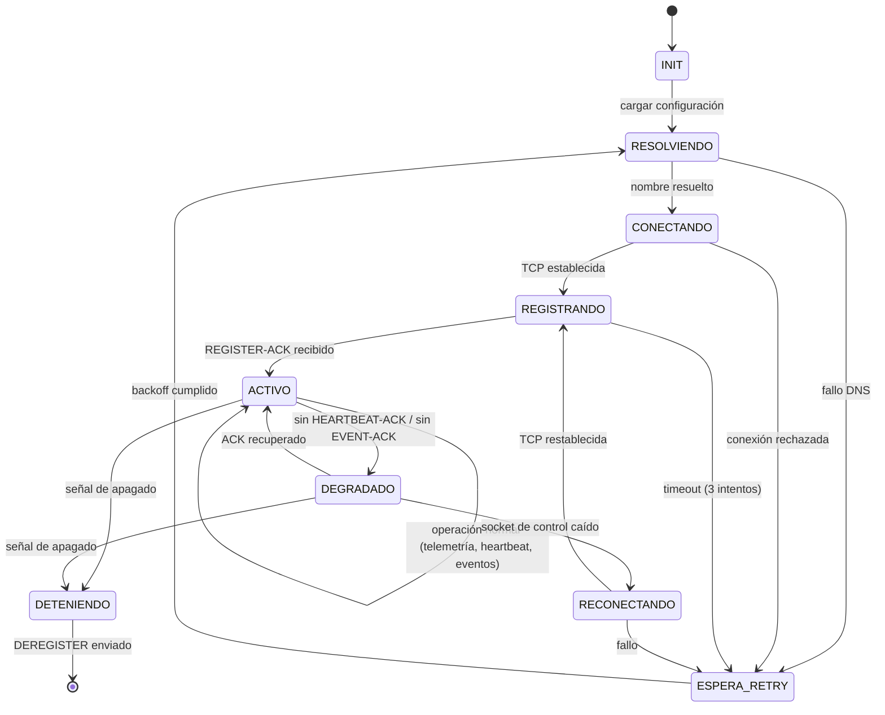
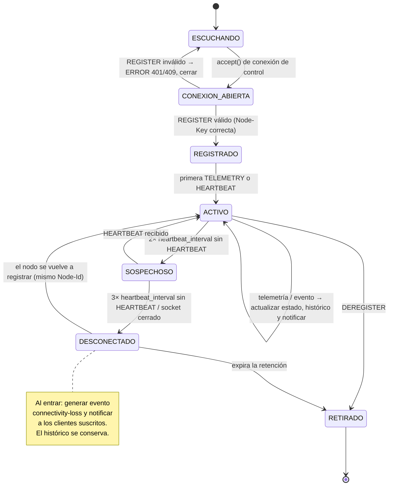
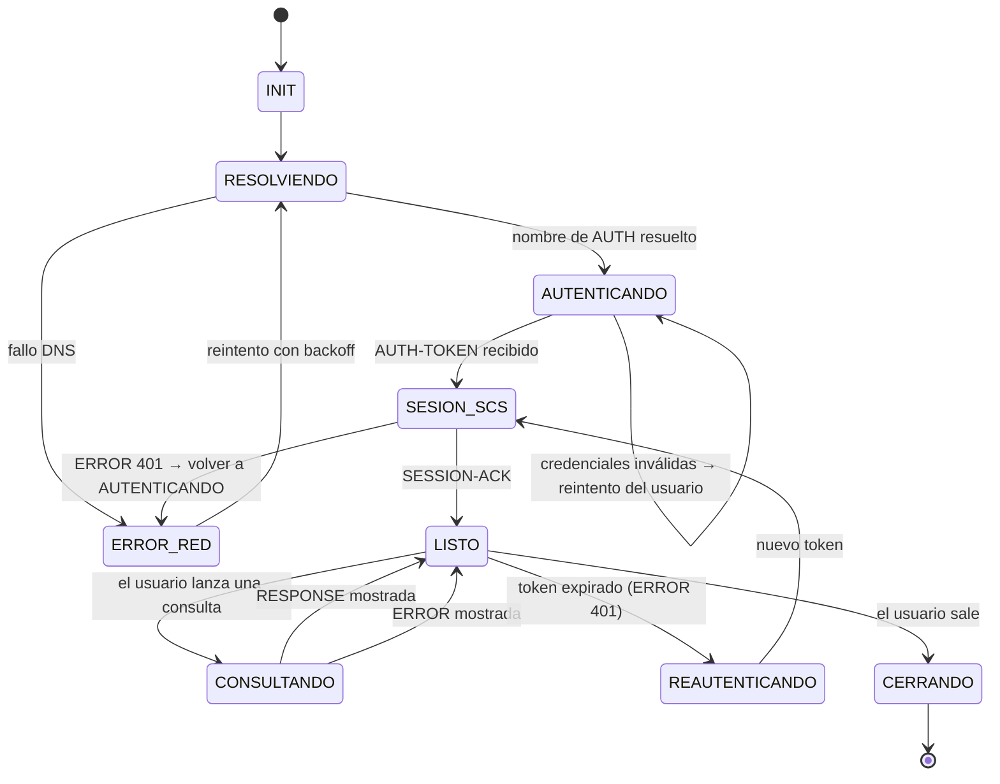
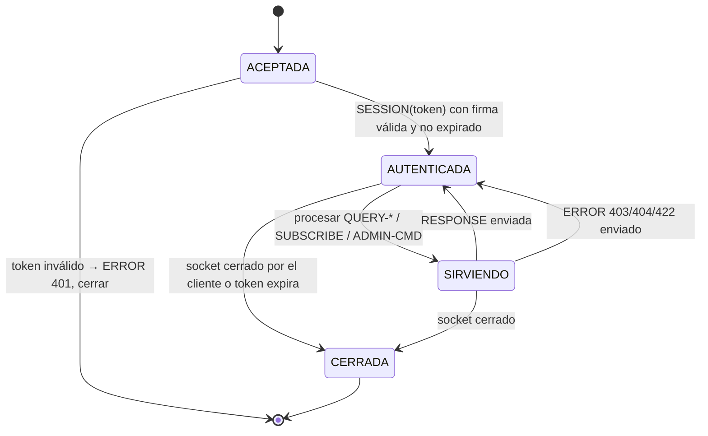

# 7. Máquinas de estado

Las máquinas de estado describen el comportamiento de cada entidad, incluyendo
los caminos de error (no solo el caso feliz).

## 7.1 Nodo

## 7.2 SCS — sesión de un nodo

## 7.3 Cliente de Administración

## 7.4 SCS — sesión de un cliente

---
**Anterior:** [← 6. Análisis TCP vs UDP](6-Analisis-TCP-UDP) · **Siguiente:** [8. Alcance y trabajo restante →](8-Alcance-y-trabajo-restante)
